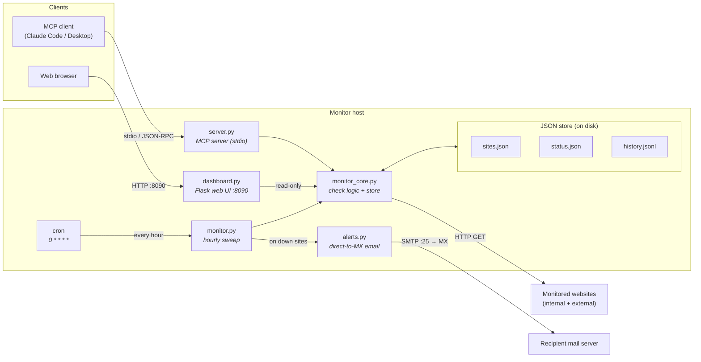

# Website Checker

A lightweight **website availability monitor** with three faces:

- 🛰️ **MCP server** — manage monitored sites and query results from any MCP client (Claude Code, Claude Desktop, etc.)
- ⏱️ **Hourly checker** — a cron-driven sweep that records uptime, latency, and status codes
- 📊 **Web dashboard** — a clean two-pane browser view (Internal vs. External) with live status and last-checked times

It has no database and no external services — state is plain JSON files on disk, so the whole thing is trivial to deploy, back up, and reason about.

  

---

## Features

| | |
|---|---|
| **Config-driven** | Sites are added/removed at runtime via MCP tools — no redeploy. |
| **Two categories** | Each site is `internal` or `external`; the dashboard shows them in separate panes. |
| **Health rule** | A site is healthy when it returns HTTP `< 400` within the timeout (default 10s). Timeouts, connection errors, and 4xx/5xx are unhealthy. |
| **Self-signed TLS** | Per-site `verify_tls=False` for internal hosts with private-CA/self-signed certs, so cert-trust failures aren't false DOWNs. |
| **History & uptime** | Every check is appended to `history.jsonl` (auto-trimmed); uptime % is computed on demand. |
| **Email alerts** | Optional down-alerts sent **directly to the recipient's MX** (SMTP :25 + opportunistic STARTTLS) — no local mail server or SMTP relay needed. |
| **Self-contained** | Pure-Python, JSON-on-disk state, one `venv`. No DB, no message broker. |
| **Safe by default** | Runtime state and any `.env` files are git-ignored; the repo ships no secrets or internal hostnames. |

---

## Architecture



**How the pieces fit:**

- `monitor_core.py` is the single source of truth: it performs the HTTP check and owns the JSON store. Everything else calls into it.
- `monitor.py` (cron, hourly) and the dashboard's "Check now" button both trigger a full sweep that **writes** status + history.
- `server.py` (MCP) and `dashboard.py` (Flask) mostly **read** that state; the MCP server also edits the site list.
- Because all three share the same files, the dashboard always reflects the most recent sweep — no coordination needed.

See [`docs/ARCHITECTURE.md`](docs/ARCHITECTURE.md) for the data-flow and sequence diagrams.

---

## Quick start

```bash
git clone https://github.com/siranjeevi93/website_checker.git
cd website_checker

python3 -m venv venv
./venv/bin/pip install -r requirements.txt

# verify everything works (uses an isolated temp store)
./venv/bin/python smoke_test.py

# run a one-off sweep, then launch the dashboard
./venv/bin/python monitor.py
./venv/bin/python dashboard.py      # http://localhost:8090
```

Add your first sites (scheme defaults to https; category defaults to external):

```bash
./venv/bin/python -c "import monitor_core as m; \
  m.add_site('https://www.example.com', 'Marketing', 'external'); \
  m.add_site('https://wiki.internal.example.com', 'Wiki', 'internal')"
```

For production install (cron schedule + boot persistence), see **[docs/INSTALLATION.md](docs/INSTALLATION.md)**.

---

## MCP tools

| Tool | Description |
|------|-------------|
| `add_site(url, name=None, category="external", verify_tls=True)` | Add/update a site. `category` is `internal` or `external`. Set `verify_tls=False` for self-signed/private-CA hosts (e.g. vCenter, `.local` appliances). Idempotent on URL. |
| `remove_site(url_or_name)` | Stop monitoring a site. |
| `list_sites()` | List configured sites. |
| `check_now(url=None)` | Run an immediate check (one URL, or all configured). |
| `status(url=None)` | Latest result per site. |
| `history(url=None, limit=50)` | Recent check history. |
| `uptime(url=None)` | Uptime % over recorded history. |
| `test_alert()` | Send a test alert email to the configured recipients. |

### Register with an MCP client

```json
{
  "mcpServers": {
    "website-checker": {
      "command": "/path/to/website_checker/venv/bin/python",
      "args": ["/path/to/website_checker/server.py"]
    }
  }
}
```

To run the server on a remote host over SSH, point `command` at `ssh` and pass the remote python + `server.py` path as args.

---

## Email alerts (optional)

When the hourly sweep finds one or more sites down, it can email a consolidated
alert. Delivery is **direct to each recipient domain's MX** over SMTP port 25
with opportunistic STARTTLS — so **no local mail server (Postfix/sendmail) and
no SMTP relay are required**. It works wherever outbound `:25` to the
recipient's MX is allowed and that MX accepts your host's mail.

Enable it by creating a git-ignored `alert.env` (copy from `alert.env.example`):

```bash
cp alert.env.example alert.env
# edit: WM_ALERT_TO=you@example.com
./venv/bin/python alerts.py --test     # send yourself a test
```

Alerts are **disabled** whenever `WM_ALERT_TO` is empty (the default), so the
feature is opt-in and the repo carries no addresses.

> **Deliverability note.** Many public providers (Gmail, Outlook/365, etc.)
> reject mail from arbitrary hosts lacking SPF/PTR. Direct-to-MX is most
> reliable when sending *within your own org's domain* or to a server that
> allowlists your egress IP. If your MX rejects it, set `WM_SMTP_HOST` to an
> internal relay/smarthost that accepts your host.

## Configuration

All settings are environment variables (sensible defaults shown). Alert vars are
typically placed in `alert.env`; the rest can go in the cron/launch environment.

| Variable | Default | Purpose |
|----------|---------|---------|
| `WM_TIMEOUT` | `10` | Per-request timeout (seconds). |
| `WM_HISTORY_MAX` | `5000` | Max history entries kept (older trimmed). |
| `WM_WEB_PORT` | `8090` | Dashboard port. |
| `WM_MONITOR_LABEL` | `Hourly availability monitoring` | Sub-title shown on the dashboard. |
| `WM_SITES` / `WM_STATUS` / `WM_HISTORY` | `./sites.json` etc. | Override store file locations. |
| `WM_ALERT_TO` | *(empty → disabled)* | Comma-separated alert recipients. |
| `WM_ALERT_FROM` | `website-monitor@<fqdn>` | Envelope/From address. |
| `WM_SMTP_HOST` | *(MX lookup)* | Force a smarthost/relay instead of direct MX. |
| `WM_SMTP_TIMEOUT` | `30` | SMTP connection timeout (seconds). |

---

## Project layout

```
website_checker/
├── server.py            # MCP server (stdio)
├── monitor.py           # hourly checker (run by cron)
├── monitor_core.py      # shared check logic + JSON store
├── dashboard.py         # Flask dashboard (:8090)
├── alerts.py            # direct-to-MX email alerts (no relay needed)
├── start-dashboard.sh   # boot/watchdog launcher for the dashboard
├── smoke_test.py        # self-contained test (isolated temp store)
├── requirements.txt
├── sites.example.json   # sample site list (copy to sites.json or use add_site)
├── alert.env.example    # sample alert config (copy to alert.env, git-ignored)
├── docs/
│   ├── ARCHITECTURE.md
│   └── INSTALLATION.md
└── .gitignore           # ignores venv, runtime state, logs, .env
```

> **Note:** `sites.json`, `status.json`, `history.jsonl`, and `*.log` are runtime
> artifacts and are intentionally **git-ignored** — they can contain
> environment-specific URLs and should never be committed.

---

## Testing

```bash
./venv/bin/python smoke_test.py
```

The smoke test points the store at a throwaway temp directory, exercises the
site list, a real HTTP check, an unreachable-host failure, persistence, and the
uptime summary — without touching your live data.

---

## License

[MIT](LICENSE)
