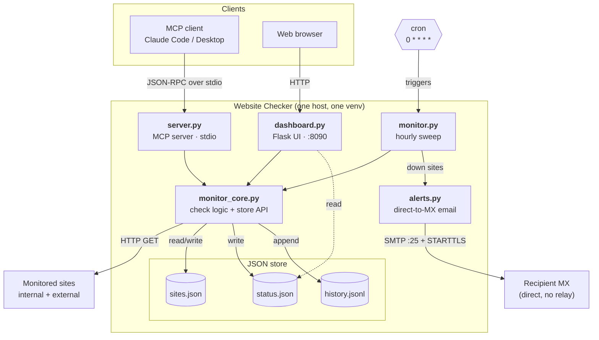
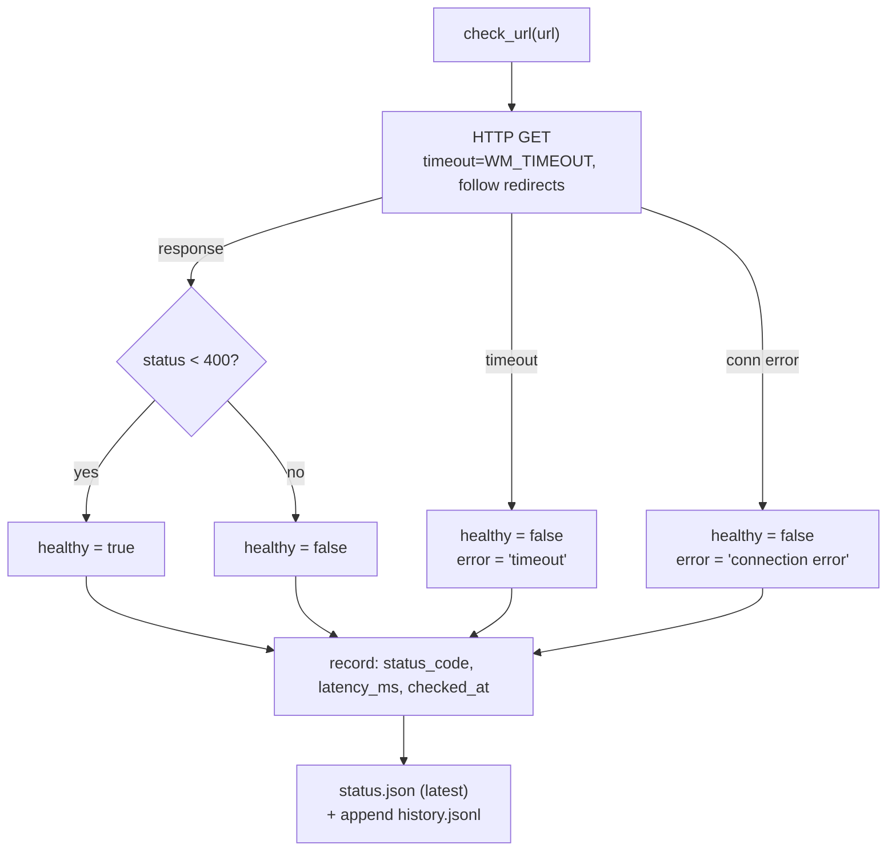
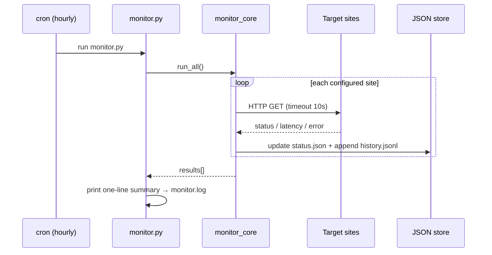

# Architecture

Website Checker is deliberately small: one shared core module, three entry
points (MCP server, cron checker, web dashboard), and a JSON-file store. There
is no database, queue, or background daemon beyond the optional dashboard
process.

## Component overview



| Component | Role | Reads | Writes |
|-----------|------|-------|--------|
| `monitor_core.py` | The engine: HTTP check, health rule, JSON store API, uptime math. | all | all |
| `server.py` | MCP server (stdio). Manage sites + expose results as tools. | store | `sites.json` |
| `monitor.py` | Run by cron every hour. Performs a full sweep. | `sites.json` | `status.json`, `history.jsonl` |
| `dashboard.py` | Flask web UI on `:8090`. Two panes (Internal / External). | store | (only via "Check now") |
| `alerts.py` | Emails down-alerts directly to the recipient's MX (SMTP :25 + STARTTLS). Opt-in via `WM_ALERT_TO`. | `alert.env` | — |
| `start-dashboard.sh` | Idempotent launcher used by `@reboot` + watchdog cron. | — | — |

## The health check



A result is a flat dict:

```json
{
  "url": "https://www.example.com",
  "checked_at": "2026-01-01T12:00:00+00:00",
  "healthy": true,
  "status_code": 200,
  "latency_ms": 87.7,
  "error": null,
  "name": "Marketing",
  "category": "external"
}
```

## Hourly sweep sequence



The dashboard never needs to talk to the checker: it simply reads the same
`status.json` / `history.jsonl` that the sweep just wrote. This shared-file
design is why there are no sockets, locks, or IPC between the three entry
points — the filesystem is the integration point. Writes are atomic
(write-to-temp + `rename`), so a reader never sees a half-written file.

## Why JSON files instead of a database

- **Zero ops** — nothing to install, secure, or back up beyond copying a folder.
- **Transparent** — `cat status.json` tells you everything.
- **Right-sized** — a single host monitoring tens of sites hourly produces
  trivial data volumes; history is capped at `WM_HISTORY_MAX` entries.

If you outgrow this (hundreds of sites, sub-minute intervals, multi-host), the
clean seam is `monitor_core.py`'s store functions — swap them for a real
datastore without touching the three entry points.
